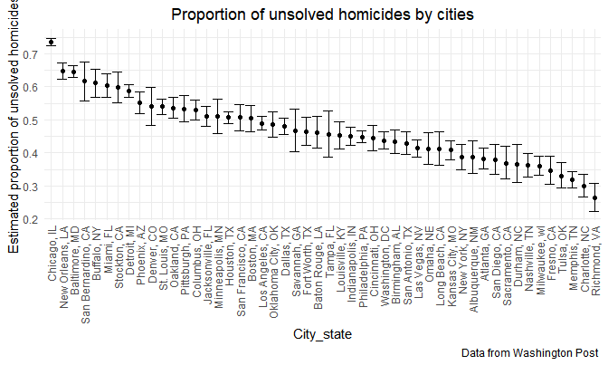

p8105_hw5_al4225
================
Anjing
2022-11-16

## Problem 2

### Raw data

**Describe the raw data.**  
In this raw dataset, it contains information about homicides in 50 large
U.S. cities. There are 52179 observations and 12 variables. Some key
variables such like victim_last, victim_first, victim_race, victim_age,
victim_sex discribe victims’ basic information about their name, race,
age and sex. Some key variables such like reported_date, city, state,
lat, lon describe the basic information about the date and location of
homicides in U.S.. The variable disposition reflects the disposition of
the murders.

``` r
homicide_data = read_csv("./data/homicide-data.csv",
                col_names = TRUE) %>%
  janitor::clean_names() 
```

    ## Rows: 52179 Columns: 12
    ## ── Column specification ────────────────────────────────────────────────────────
    ## Delimiter: ","
    ## chr (9): uid, victim_last, victim_first, victim_race, victim_age, victim_sex...
    ## dbl (3): reported_date, lat, lon
    ## 
    ## ℹ Use `spec()` to retrieve the full column specification for this data.
    ## ℹ Specify the column types or set `show_col_types = FALSE` to quiet this message.

``` r
homicide_data
```

    ## # A tibble: 52,179 × 12
    ##    uid   repor…¹ victi…² victi…³ victi…⁴ victi…⁵ victi…⁶ city  state   lat   lon
    ##    <chr>   <dbl> <chr>   <chr>   <chr>   <chr>   <chr>   <chr> <chr> <dbl> <dbl>
    ##  1 Alb-…  2.01e7 GARCIA  JUAN    Hispan… 78      Male    Albu… NM     35.1 -107.
    ##  2 Alb-…  2.01e7 MONTOYA CAMERON Hispan… 17      Male    Albu… NM     35.1 -107.
    ##  3 Alb-…  2.01e7 SATTER… VIVIANA White   15      Female  Albu… NM     35.1 -107.
    ##  4 Alb-…  2.01e7 MENDIO… CARLOS  Hispan… 32      Male    Albu… NM     35.1 -107.
    ##  5 Alb-…  2.01e7 MULA    VIVIAN  White   72      Female  Albu… NM     35.1 -107.
    ##  6 Alb-…  2.01e7 BOOK    GERALD… White   91      Female  Albu… NM     35.2 -107.
    ##  7 Alb-…  2.01e7 MALDON… DAVID   Hispan… 52      Male    Albu… NM     35.1 -107.
    ##  8 Alb-…  2.01e7 MALDON… CONNIE  Hispan… 52      Female  Albu… NM     35.1 -107.
    ##  9 Alb-…  2.01e7 MARTIN… GUSTAVO White   56      Male    Albu… NM     35.1 -107.
    ## 10 Alb-…  2.01e7 HERRERA ISRAEL  Hispan… 43      Male    Albu… NM     35.1 -107.
    ## # … with 52,169 more rows, 1 more variable: disposition <chr>, and abbreviated
    ## #   variable names ¹​reported_date, ²​victim_last, ³​victim_first, ⁴​victim_race,
    ## #   ⁵​victim_age, ⁶​victim_sex

### Homicides

Create a city_state variable (e.g. “Baltimore, MD”) and then summarize
within cities to obtain the total number of homicides and the number of
unsolved homicides (those for which the disposition is “Closed without
arrest” or “Open/No arrest”).

**Discriptions**:  
First, I created a city_state variable to show the summarized
information of location like “Baltimore, MD”. Then I noticed that one
homocide‘s city_state is wrong which is “Tulsa, AL” so I delete this row
because we don’t know whether the city name or the state name is wrong.
Then I summarized the total number of homicides and the number of
unsolved homicides by cities.  
The total number of homicides of all cities is 52178. The total number
of unsolved homicides in all cities is 26505. In each city, the total
and unsolved number of homicides in each city are shown below. We can
see that Chicago, IL has the largest total(5535) and unsolved(4073)
number of homicides so the city is relatively dangeous. Tampa, FL has
the minimum total(208) and unsolved(95) number of homicides so the city
is relatively safe.

``` r
homicide = 
  homicide_data %>%
  mutate(
    city_state = str_c(city, ", ", state)) %>%
  mutate(disposition_situation = ifelse(disposition %in% c("Closed without arrest", "Open/No arrest"), "unsolved", "solved")) %>%
  filter(city_state != "Tulsa, AL")

nrow(homicide)
```

    ## [1] 52178

``` r
total_homicide = 
homicide %>%
  filter(disposition_situation == "unsolved") %>%
  nrow()
total_homicide
```

    ## [1] 26505

``` r
total_homicides =
  homicide %>%
  group_by(city_state) %>%  
  summarize(
    n_obs = n()) %>%
  arrange(desc(n_obs))
total_homicides
```

    ## # A tibble: 50 × 2
    ##    city_state       n_obs
    ##    <chr>            <int>
    ##  1 Chicago, IL       5535
    ##  2 Philadelphia, PA  3037
    ##  3 Houston, TX       2942
    ##  4 Baltimore, MD     2827
    ##  5 Detroit, MI       2519
    ##  6 Los Angeles, CA   2257
    ##  7 St. Louis, MO     1677
    ##  8 Dallas, TX        1567
    ##  9 Memphis, TN       1514
    ## 10 New Orleans, LA   1434
    ## # … with 40 more rows

``` r
unsoved_homicides = 
  homicide %>%
  filter(disposition_situation == "unsolved") %>%
  group_by(city_state) %>%  
  summarize(
    n_obs = n()) %>%
  arrange(desc(n_obs))
unsoved_homicides
```

    ## # A tibble: 50 × 2
    ##    city_state       n_obs
    ##    <chr>            <int>
    ##  1 Chicago, IL       4073
    ##  2 Baltimore, MD     1825
    ##  3 Houston, TX       1493
    ##  4 Detroit, MI       1482
    ##  5 Philadelphia, PA  1360
    ##  6 Los Angeles, CA   1106
    ##  7 New Orleans, LA    930
    ##  8 St. Louis, MO      905
    ##  9 Dallas, TX         754
    ## 10 Jacksonville, FL   597
    ## # … with 40 more rows

### prop.test

For the city of Baltimore, MD, use the prop.test function to estimate
the proportion of homicides that are unsolved; save the output of
prop.test as an R object, apply the broom::tidy to this object and pull
the estimated proportion and confidence intervals from the resulting
tidy dataframe.  
**Description**:  
For Baltimore, MD, the estimated proportion of homicides that are
unsolved is 0.6455607. The confidence interval is (0.6275625, 0.6631599)
in α=0.05 level which means that we are 95% confident that the true
proportion of homicides that are unsolved lies in this interval. It
concludes the estimated value.

``` r
Baltimore = 
homicide %>%
  filter(city_state == "Baltimore, MD")

total_unsolved_Baltimore = 
  Baltimore %>%
  summarise(
    unsolved = sum(disposition_situation == "unsolved"),
    n = n()
  )

total_unsolved_Baltimore
```

    ## # A tibble: 1 × 2
    ##   unsolved     n
    ##      <int> <int>
    ## 1     1825  2827

``` r
prop_test = 
  prop.test(
    x = total_unsolved_Baltimore %>% pull(unsolved),
    n = total_unsolved_Baltimore %>% pull(n)
  )
prop_test
```

    ## 
    ##  1-sample proportions test with continuity correction
    ## 
    ## data:  total_unsolved_Baltimore %>% pull(unsolved) out of total_unsolved_Baltimore %>% pull(n), null probability 0.5
    ## X-squared = 239.01, df = 1, p-value < 2.2e-16
    ## alternative hypothesis: true p is not equal to 0.5
    ## 95 percent confidence interval:
    ##  0.6275625 0.6631599
    ## sample estimates:
    ##         p 
    ## 0.6455607

``` r
prop_test %>%
  broom::tidy()
```

    ## # A tibble: 1 × 8
    ##   estimate statistic  p.value parameter conf.low conf.high method        alter…¹
    ##      <dbl>     <dbl>    <dbl>     <int>    <dbl>     <dbl> <chr>         <chr>  
    ## 1    0.646      239. 6.46e-54         1    0.628     0.663 1-sample pro… two.si…
    ## # … with abbreviated variable name ¹​alternative

### prop.test for each city

Now run prop.test for each of the cities in your dataset, and extract
both the proportion of unsolved homicides and the confidence interval
for each. Do this within a “tidy” pipeline, making use of purrr::map,
purrr::map2, list columns and unnest as necessary to create a tidy
dataframe with estimated proportions and CIs for each city.

``` r
total_unsolved_cities = 
  homicide %>%
  group_by(city_state) %>% 
  summarise(
    unsolved_cities = sum(disposition_situation == "unsolved"),
    n_cities = n()
  )

total_unsolved_cities
```

    ## # A tibble: 50 × 3
    ##    city_state      unsolved_cities n_cities
    ##    <chr>                     <int>    <int>
    ##  1 Albuquerque, NM             146      378
    ##  2 Atlanta, GA                 373      973
    ##  3 Baltimore, MD              1825     2827
    ##  4 Baton Rouge, LA             196      424
    ##  5 Birmingham, AL              347      800
    ##  6 Boston, MA                  310      614
    ##  7 Buffalo, NY                 319      521
    ##  8 Charlotte, NC               206      687
    ##  9 Chicago, IL                4073     5535
    ## 10 Cincinnati, OH              309      694
    ## # … with 40 more rows

**Descriptions:**  
This dataset reflects each city’s estimated proportion of unsolved
homicides and the confidence interval.

``` r
results_cities = 
  total_unsolved_cities %>% 
  mutate(
    prop_tests = map2(.x = unsolved_cities, .y = n_cities, ~prop.test(x = .x, n = .y)),
    tidy_tests = map(.x = prop_tests, ~broom::tidy(.x))
  ) %>% 
  select(city_state, tidy_tests) %>% 
  unnest(tidy_tests) %>% 
  select(city_state, estimate, conf.low, conf.high)
results_cities
```

    ## # A tibble: 50 × 4
    ##    city_state      estimate conf.low conf.high
    ##    <chr>              <dbl>    <dbl>     <dbl>
    ##  1 Albuquerque, NM    0.386    0.337     0.438
    ##  2 Atlanta, GA        0.383    0.353     0.415
    ##  3 Baltimore, MD      0.646    0.628     0.663
    ##  4 Baton Rouge, LA    0.462    0.414     0.511
    ##  5 Birmingham, AL     0.434    0.399     0.469
    ##  6 Boston, MA         0.505    0.465     0.545
    ##  7 Buffalo, NY        0.612    0.569     0.654
    ##  8 Charlotte, NC      0.300    0.266     0.336
    ##  9 Chicago, IL        0.736    0.724     0.747
    ## 10 Cincinnati, OH     0.445    0.408     0.483
    ## # … with 40 more rows

### Plots

Create a plot that shows the estimates and CIs for each city – check out
geom_errorbar for a way to add error bars based on the upper and lower
limits. Organize cities according to the proportion of unsolved
homicides.  
**Description**:  
In this plot, we can see the proportion of unsolved homicides in each
city from high to low and the error bar in each point. The overall
proportions of unsolved homicides are between 0.25 and 0.75. Chicago has
the highest proportion of unsolved homicides which reflects the unsafety
of this city in a way and Richmond has the lowest proportion of unsolved
homicides which reflects the safety of this city relatively.

``` r
results_cities_plot = 
results_cities %>% 
  mutate(city_state = fct_reorder(city_state, estimate, .desc = TRUE)) %>% 
  ggplot(aes(x = city_state, y = estimate)) +
  geom_point() + 
  geom_errorbar(aes(ymin = conf.low, ymax = conf.high)) + 
  geom_smooth(se = TRUE) +
  labs(
    title = "Proportion of unsolved homicides by cities",
    x = "City_state",
    y = "Estimated proportion of unsolved homicides",
    caption = "Data from Washington Post "
  ) +
  theme(legend.position = "bottom") +
  theme(axis.text.x = element_text(angle = 90, hjust = 1, vjust = .5),
        plot.title = element_text(hjust = 0.5))
results_cities_plot
```

    ## `geom_smooth()` using method = 'loess' and formula 'y ~ x'



## Problem 3

When designing an experiment or analysis, a common question is whether
it is likely that a true effect will be detected – put differently,
whether a false null hypothesis will be rejected. The probability that a
false null hypothesis is rejected is referred to as power, and it
depends on several factors, including: the sample size; the effect size;
and the error variance. In this problem, you will conduct a simulation
to explore power in a one-sample t-test.

### the t-test

First set the following design elements:

Fix n=30  
Fix σ=5  
Set μ=0. Generate 5000 datasets from the model.  
x∼Normal\[μ,σ\]

For each dataset, save μ^ and the p-value arising from a test of H:μ=0
using α=0.05. Hint: to obtain the estimate and p-value, use broom::tidy
to clean the output of t.test.  
Repeat the above for μ={1,2,3,4,5,6}.

**Description**:  
First, I write a function to conduct the t-test of norm and map μ =
0,1,2,3,4,5,6 to this function then we get the p-value summary table
below.

``` r
sim_t_test = 
  function(true_mean){
    sample = tibble(rnorm(30, mean = true_mean, sd = 5))
    
    test_result = t.test(sample)
    
    test_result %>%
      broom::tidy()
  }

sim_results_df = 
  expand_grid(
    true_mean = 0:6,
    iter = 1:5000) %>%
  mutate(estimate_df = map(true_mean, sim_t_test)) %>%
  unnest(estimate_df) %>%
  select(true_mean, iter, estimate, p.value) %>%
  mutate(test_result = ifelse(p.value < 0.05, "reject H0", "fail to reject H0"))
sim_results_df
```

    ## # A tibble: 35,000 × 5
    ##    true_mean  iter estimate p.value test_result      
    ##        <int> <int>    <dbl>   <dbl> <chr>            
    ##  1         0     1    1.07   0.243  fail to reject H0
    ##  2         0     2   -1.00   0.272  fail to reject H0
    ##  3         0     3    0.580  0.537  fail to reject H0
    ##  4         0     4    1.54   0.0785 fail to reject H0
    ##  5         0     5   -0.616  0.505  fail to reject H0
    ##  6         0     6   -0.156  0.833  fail to reject H0
    ##  7         0     7    0.429  0.623  fail to reject H0
    ##  8         0     8   -1.08   0.243  fail to reject H0
    ##  9         0     9    0.407  0.692  fail to reject H0
    ## 10         0    10   -0.493  0.547  fail to reject H0
    ## # … with 34,990 more rows

### True_mean-power plot

The proportions of times the null was rejected (the power of the test)
are between 0 and 1. Other conditions remain the same, the power and
effect size are positive associated. The greater the difference between
the true and estimated values of the population parameters, the greater
the power. It can also be said that the larger the effect size, the
greater the efficacy.

``` r
n_obs_reject_df =
sim_results_df %>% 
  group_by(true_mean) %>% 
  filter(test_result == "reject H0") %>%
  summarize(
    n_obs_reject = n()) %>%
  mutate(percent = n_obs_reject / 5000) %>%
  ggplot(aes(x = true_mean, y = percent)) +
  geom_point(size = 1.5) +
  geom_line() +
  labs(
    title = "True_mean-power plot",
    x = "True mean",
    y = "The power of the test") +
  theme(legend.position = "bottom") +
  theme(axis.text.x = element_text(hjust = 1, vjust = .5),
        plot.title = element_text(hjust = 0.5))

n_obs_reject_df
```


